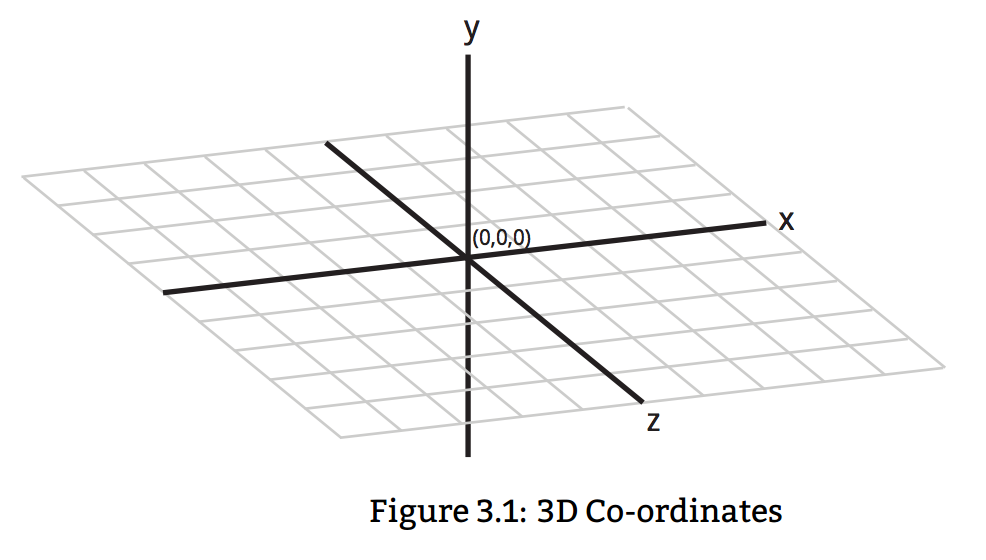

## 第三章 Python 语法

语法是编程语言使用的一套基本规则。这些规则主要是Python里用的语法和符号。

为了让计算机理解程序员给它的指令，语法是必须的。没有语法，计算机不能理解程序员要它做的事情。

理解语法是必须的，因为它是编程的基础。不理解语法，就无法与计算机沟通。

这一章介绍Python语法的基础知识。在开始的部分，有几个Minecraft的编程挑战，每一个挑战都要求你有对应的基础知识。所以建议你在开始练习之前，先完成Codecademy 上Python教程，除非你喜欢冒险。如果你不太记得如何使用某一概念，本章已经包括了你在 Codecademy上学到的一切知识。

正如本书的每一章节，你可以用不同的方式使用本章的内容：

* 通过这里的练习来验证你的理解是否正确；
* 当你需要额外的帮助来理解Codecdemy的教程的时候，可以参看本书；
* 当你写程序时，帮助你回忆；
* 当你要考试时，用本书来复习。

本书撰写的目的就是帮助你学习编程的，所以你可以在任何需要的时候用它。

#### 3.1 Minecraft练习

我们来练习变量的使用。这里的每个练习都向你展示了一些使用变量的代码。这些练习会教你如何移动玩家的位置，如何阻止玩家破坏游戏中的块。对每个练习，我们都会告诉你其中的概念和练习的难度。当需要的时候，我们甚至会解释Minecraft的代码。

在做这些练习的时候，注意其中的变量以及它们的用法。这将帮助你理解发生了什么。如果有你不理解的，可以查看前面的章节。

如果你觉得自己以及掌握了，就可以做写扩展练习。你也可以按照自己的创意和想法，尝试修改、重新组合这些代码。

##### 3.1.1 移动玩家

-----------------------------------

**知识与技巧**

本练习中，我们将练习的知识和技巧:

* 变量
* 我的世界的API
* 整数
* 设置玩家的位置
* 坐标
-----------------------------------

让我们开始使用Python和
Minecraft API的第一个程序。我们先做简单的事情，用整数移动玩家到一个新的位置。

你的角色在Minecraft的世界里有一个坐标。由x、y、z这三个数字来表示，你可以在游戏窗口的左上角看到这三个数字。

当你移动时会发现这三个数字在变化。这些变量代表着你在Minecraft的3D世界里的坐标。如图 3.1.1 所示: y 表示高度， x，z 代表你在平面上的位置。

用Python代码也可以像用键盘那样，改变你角色的位置。我们将用代码告诉你如何去做。

**指令**

创建一个新文件，并命名为 teleport.py。移动 Minecraft API 文件夹到同一文件夹内，具体的命令参看第二章。

现在在一个文本编辑器中打开 teleport.py 文件。首先，我们需要两行连接我们的程序到 Minecraft的代码。这两行代码会用在所有和Minecraft交互的程序里。添加这两行代码到你的程序顶部:

	1. import mcpi.minecraft as minecraft
	2. mc = minecraft.Minecraft.create()

我们现在将创建表示 x、 y 、z的三个整数变量，这代表我们想把角色移动到的坐标。现在让我们来设置我们目标坐标 (10，11，12)。

	4. x = 10
	5. y = 11
	6. z = 12
	
最后我们需要一行代码移动玩家。

	7. mc.player.setTilePos(x,y,z)

这是一个函数，以后我们会进一步学习函数。现在，你需要知道的是，setTilePos(x,y,z)是告诉Minecraft，把玩家移动到我们用xyz，这三个变量设置的位置上。

下面是完整代码，我们会加一些注释，方便理解：

	1. #connect to Minecraft
	2. import mcpi.minecraft as minecraft
	3. mc = minecraft.Minecraft.create()
	4. 	
	5. ”””set x,y and z variables
	6. to represent coordinates”””
	7. x = 10
	8. y = 11
	9. z = 12
	10. 	
	11. #change the player’s position
	12. mc.player.setTilePos(x,y,z)

现在让我们来运行程序，按下面的步骤做：

1. 打开Minecraft Pi版
2. 打开一个控制台并将目录更改到你保存程序的目录
3. 在控制台输入：python teleport.py然后回车

**扩展练习**

* 改变x、y、z三个变量的值
* 给x、y、z三个变量赋负值

. . . . . . . . . . . . . . . . . . . . . . . . . . . . . . . . . . . . . . . . . . . . . . . . . . . . . . . . . . . . .

**警报箱**

**注意**: 不要给x、z变量赋大于127的值，也不要把大于[find value]赋给y变量。
Minecraft树莓派版的世界很小，赋值过大会导致游戏崩溃。 [check this]

. . . . . . . . . . . . . . . . . . . . . . . . . . . . . . . . . . . . . . . . . . . . . . . . . . . . . . . . . . . . .

##### 3.1.2 精确的移动玩家

-----------------------------------

**知识与技巧**

本练习中，我们将练习的知识和技巧:

* 变量
* 浮点类型
* 用浮点类型设置玩家位置
* 跟随指令
* Minecraft API

-----------------------------------

在这个练习里，我们将不会提供可以拷贝的代码，我们只会提供必要的帮助。别担心，这个练习和上一个非常相似，只有微小的差别。

在上一个练习里，我们学习了如何用整数设置玩家位置。
您可能已经注意到了，在窗口顶部的左侧显示的玩家位置是有小数位的。为了更精确的移动，在游戏里，玩家的位置是用浮点型存储的。

**指令**

参考上一个例子，按下面的步骤，用浮点型移动玩家的位置：
1. 创建一个名为 teleportPrecise.py的新文件 (确保与Minecraft API文件夹在同一目录下)
2. 打开 teleportPrecise.py，添加那两行连接到Minecraft游戏的代码
3. 定义三个变量x，y，z，并用赋给他们浮点型的值
4. 添加这行代码 mc.player.setPos(x,y,z)
5. 打开Minecraft游戏，运行代码

注意mc.player.setPos(x,y,z)和上个练习中mc.player.setTilePos(x,y,z)的不同：

* setPos(x,y,z) 使用浮点型设置玩家位置
* setTilePos(x,y,z) 使用整型

**扩展练习**

* 改变x,y,z变量的值，赋值时混合整数和负数
* 看看修改变量，只保留小数点前的数时会发生什么

##### 3.1.2 瞬间移动之旅

-----------------------------------

**知识与技巧**

本练习中，我们将练习的知识和技巧:

* 重用代码
* 设置玩家的位置
* 改变变量值
* 定时

-----------------------------------

在这个练习里我们将试验改变变量的值。我们将复用第一个练习里的部分代码，来穿越地图移动玩家到多个位置。玩家将移动到一个位置，然后等待几秒，再移动到另外的位置。

为了完成这个练习，我们将向你展示如何让Python暂停几秒。

**指令**

我们将使用第一个练习的代码。为了方便起见，我们把它拷贝到了这里。如果你想使用第二个练习里的代码，也没有问题。

	1. #connect to Minecraft
	2. import mcpi.minecraft as minecraft
	3. mc = minecraft.Minecraft.create()
	4. 	
	5. ”””set x,y and z variables
	6. to represent coordinates”””
	7. x = 10
	8. y = 11
	9. z = 12
	10. 	
	11. #change the player’s position
	12. mc.player.setTilePos(x,y,z)

让我们开始吧。像往常一样，请执行下列操作。因为所有的练习都需要这些步骤，所以从现在起，我们不再告诉你该怎么做了。

1. 像往常那样创建一个新文件，文件的命名要能简单的说明它的目的，在这个练习中使用tour.py
2. 确保Minecraft API在相同的目录下
3. 用文本编辑器打开文件

现在让我们开始编辑代码：

1. 拷贝teleport.py的代码到tour.py
2. 在第4行，增加下列代码：import time
3. 在第11行，增加下列代码：time.sleep(5)
4. 把第5行到第10行的代码，拷贝到第12行后面
5. 改变13、14、15行，x,y,z变量的值
6. 打开Minecraft游戏，并运行代码

你将看到玩家移动到第一个位置，然后等待五秒，然后移动到第二个位置。time.sleep(5)，这行代码让Python暂停了五秒。

**扩展练习**

暂停不同的时间
拷贝代码，按你的想法，让玩家移动多次
只改变一个变量，你不用每次都要改变所有的变量

##### 3.1.4 阻止打碎块

-----------------------------------

**知识与技巧**

本练习中，我们将练习的知识和技巧:

* 布尔值
* 不可改变的块（Immutable Blocks）
* 解决问题

-----------------------------------

这个有个不错的简单任务来结束本章的练习。在Minecraft中很容易打碎块。当你想破坏什么东西的时候，这很有用。但是如果你花费了很多时间建造的很酷的什么东西，被破坏了，那就很烦人了。在这个练习中，我们可以让玩家无法搞破坏。

指令（Instructions）

通过把变量world_immutable设置成True，你可以让块变成不可更改的。不可更改意味着不能改变。

你需要如下的代码：

	1.	import mcpi.minecraft as minecraft
	2. mc = minecraft.Minecraft.create()
	3. 
	4. mc.setting(world_immutable, True)

创建这段程序并运行它之后，会发现你已经无法打碎各种块了。

你现在的任务是拷贝这段程序到新的文件里，修改它，让玩家可以打碎块。
提示：那里有一个布尔值。

**扩展练习**

试着射一支箭出去。看看会发生什么？想想为什么会这样？

#### 3.2 变量和数据类型

变量在计算机的内存中存储了一块数据。变量可存储的数据有不同的类型，包括数字和字符串。从姓名到GPS坐标，这些数据类型可以存储各种各样的数据。

变量是我们要学习的重要概念，因为它是编程的基础。

##### 变量

*概念*

变量在计算机的内存中存储数据。这个数据可以是某个事物的编号，例如：数字，字母，或者是符号。每个变量都有一个名字（变量名）和值。等于号=被用作给一个变量赋值。在赋值的时候，变量名总在等号（=）的左边，值在等于号（=）的右边。

**表达式：**

	1. variableName = value （变量名=变量的值）

**语句**

	1. age = 23
	2. height = 162.5
	3. canDrive = True

创建一个变量你需要三件事：一个变量名，一个等于号（=） ，一个值。在下面的例子里，“speed”是变量名，30是变量的值：

	1. speed = 30

变量名可以随意的起名，不过最好还是从名字上反映出变量的目的。这将帮助别人和未来的自己理解代码。变量可以存储多种数据类型，在这一章里，我们主要关注三种数据类型：

* Integers 整型
* Floats 浮点型
* Booleans 布尔型

##### 3.2.1 Integers 整数型

你日常生活的每一天都会遇到整数。整数是完整的数。例如：街上有12个人，你要去和五个朋友聚会，你刚买了2个苹果。以上这些数量都是用整数来表示的。

整数又可以分成整数和负数。负数是小于0的数。负数数字前会加一个减号( - )标识.

在Python中使用整数很容易。说我们需要5张猫的照片。在Python可以这样来声明：

	1.	cats=5

所有的变量，变量名都写在这行的开头。然后我们写一个等号（=），告诉Python我们将把一个值赋给这个变量。最后，我们写上希望这个变量存储的整数型数值。

写正数变量值的时候，不能加入任何空格、字母或符号。否则Python会迷惑，不理解你想要创建一个整数。符号 - 是唯一的例外。它表示你想创建一个负数值。例如，表示当前温度是零下5度，可以这样表示：
	
	1. temperature = -5

-------------------------

**整数型**

*数据类型*

一种数据类型，是完整的数，包括正数和负数。例如：0，32，-6，194689，-5都是整数。3.14和6.025不是整数型，因为它们有小数点。

**表达式**

	1. 12

**语句**

	1. age = 12

-------------------------

##### 3.2.2 Floats 浮点型

不是所有的数字都是整数。小数位用来表示不是完整的数值。例如，你可能有半个（0.5）苹果，你的时薪是7.34英镑，市场离你家有2.6英里远。

当需要更高精度的时候，通常会用浮点型代替整形。

整型只在事物能被整数表述的时候才有意义，例如你有两只猫。不可能有两个半只猫。而浮点型在有分数的情况下很有意义。例如，温度可以是-6.3度，17.4度，18.9度等等。

浮点可以被表示成整数，但是整数不能表示有小数点的数。

你可以把这些和数学联系在一起。整数被用来表示离散数据，浮点数常常被用来表示连续数据。

在Python里，声明一个浮点数变量和声明其他类型的变量是一样的，不同只是变量的值包括了小数点。例如我们声明1.34升的水：

	1. litresOfWater = 1.34

创建一个负的浮点型，你只需要加上- 减号：

	1. temperature = -4.37

. . . . . . . . . . . . . . . . . . . . . . . . . . . . . . . . . . . . . . . . . . . . . . . . . . . . . . . . . . . . .

**浮点型**

*数据类型*

有小数点的数字，包括正数和负数。例如，3.14, 6.025, 105896.7584926, -8.276 ,1.00 都是浮点数。

**表达式**

	1. 17.5

**语句**

	1. tax = 17.5

. . . . . . . . . . . . . . . . . . . . . . . . . . . . . . . . . . . . . . . . . . . . . . . . . . . . . . . . . . . . .

##### 3.2.3 Booleans 布尔型

布尔型是一种有趣的数据类型。它只有两个可能的值：Ture或者False。
想象一个灯的开关，它只能开或者关。布尔型也是类似的，它要么是True（开），要么是False（关）。

在Python中，我们可以声明一个布尔型变量来表示灯开着：

	1. light = True

当灯关闭时，可以写成这样：

	1.	light = False

布尔型的值，True和False的首字母需要大写。

布尔型有很多的用途。它们在表示答案的真假时特别有用。例如，有人睡着了吗？狗饿了吗?在下雨吗?

. . . . . . . . . . . . . . . . . . . . . . . . . . . . . . . . . . . . . . . . . . . . . . . . . . . . . . . . . . . . .

**布尔型**

*数据类型*

要么是真，要么是假的数据。也可以表示成1或0，开或关。

**表达式**

	1. True
	2. False

**语句**

	1. canFly = True
	2. isBird = False

. . . . . . . . . . . . . . . . . . . . . . . . . . . . . . . . . . . . . . . . . . . . . . . . . . . . . . . . . . . . .

##### 3.2.4 修改变量的值

你可以随时修改变量的值。修改的方式与创建变量是一样的，都是通过等于号（=）。例如，我们声明变量cats 等于5，当我们买了更多的猫的时候，我们想修改成10。那么在Python中可以这么做：

	1.	cats = 5
	2. cats = 10

变量cats开始是5，然后被修改成了10. 修改后，变量cats会忘记旧值，记住新值。就这么简单。

. . . . . . . . . . . . . . . . . . . . . . . . . . . . . . . . . . . . . . . . . . . . . . . . . . . . . . . . . . . . .

**警报箱**

**注意**: Python执行代码，是以行为单位，从上到下执行的。也就是说，Python会先执行第一行，再执行第二行，以此类推。
在修改变量值的时候要记住这一点。

. . . . . . . . . . . . . . . . . . . . . . . . . . . . . . . . . . . . . . . . . . . . . . . . . . . . . . . . . . . . .

#### 3.3 空格和语句

在执行你的代码的时候，Python需要知道，什么时候停止读取一条指令，什么时候开始读取下一条。这里就需要语句和空格的介入。

想想一下在英语中。如果我的句子没有句号，那么就很难理解我想对你表达的内容。例如：

	There are no dragons in the pub there is a witch

这是相当难理解的。但是当加了正确的标点符号：

	There are no dragons. In the pub there is a witch.
	
看出我的意思了吧？句号的使用，让我的句子变得易于理解。这使沟通变得容易。编程语言中的语法正是起到了这样的作用，把指令清晰无误的告诉了计算机。

##### 3.3.1 语句和断行

把你代码中的指令想象成句子。在英语中，结束一个句子要用到句号。而在Python里，用新起一行，来表示一条指令的结束。

Python里每一行的指令，被称作一条语句。Python要求每条语句都要新起一行，以便区分。

例如，要创建三个变量，在Python里要这样写：

	1. socks = 12
	2. human = True
	3. age = 25

注意，每条语句都另起一行。这意味着Python能理解你想创建三个变量。如果你把所有的语句都写在一行上，Python就疑惑了：

	1. socks = 12 human = True age = 25

这段代码Python不能理解你的意图，它不知道哪里是一条语句的结束，哪里是另一条语句的开始。当Python疑惑时，它就不能做你想让他做的。他将用一个错误提示，告诉你他的疑惑。

##### 3.3.2 缩进

有时候把一些代码打包在一起是必要的。这对重用代码很有帮助，可以执行相同的指令，但配以不同的选项。Python用缩进和空格来做这个事情（打包代码）。

. . . . . . . . . . . . . . . . . . . . . . . . . . . . . . . . . . . . . . . . . . . . . . . . . . . . . . . . . . . . .

**警报箱**

**注意**: 缩进对Python很重要。但以后我们才会深度涉及这个主题。现在只要记住，避免在代码行的开头输入tab键或者敲入多个空格就行了，因为这会让Python疑惑，报错，会使你的程序产生异常。

. . . . . . . . . . . . . . . . . . . . . . . . . . . . . . . . . . . . . . . . . . . . . . . . . . . . . . . . . . . . .

#### 3.4 注释

注释是让Python解释器忽略你的代码。虽然注释不做任何事情，但是他是有用的。

注释可以用来在代码里写笔记，这样以后你就能读懂这段代码做了什么。注释也可以阻止编译器执行你的代码。这在你测试，调试bug的时候是很有用的。Python有两种方式写注释：单行和多行。

. . . . . . . . . . . . . . . . . . . . . . . . . . . . . . . . . . . . . . . . . . . . . . . . . . . . . . . . . . . . .

**单行注释**

*注释*

注释告诉编译器不要读取注释中的代码。单行注释只能阻止编译器读取一行Python代码。单行注释用#符号表示，需要加在要注释代码的前面。

**表达式**

	1. #Commented text

**语句**

	1.	#Sets characteristics of a person
	2.	name = ”Helen” #person’s name

. . . . . . . . . . . . . . . . . . . . . . . . . . . . . . . . . . . . . . . . . . . . . . . . . . . . . . . . . . . . .

##### 3.4.1 单行注释

让我们看一下使用单行注释的不同方式：

	1.	#We have 5 cats
	2. cats = 5

上面的代码Python编译器会忽略第一行，读取第二行。

如果你还想让Python编译器忽略第二行，可以把#号加在第二行代码的前面，像这样：

	1.	#We have 5 cats
	2. #cats = 5

这样Python就不会创造变量cats，也不会把5赋给cats，这行被编译器忽略了。

你可以把注释放在完整语句的最后，例如：

	1.	cats = 5 #We have 5 cats

这条语句是可以工作的，Python会创建变量cats，并把5赋给它。

然而，如果我们移动注释符（#）到这行的前面一点，我们就会收到报错。报错的原因是这条语句不完整：

	1. cats = #5 We have 5 cats

Python会感到迷惑，因为它期望你会给变量赋值，但是没有，因为注释符后面的代码都被忽略了。要避免这样。

##### 3.4.2 多行注释

有时你会希望Python能忽略多行代码。你可能要为代码写个长长的说明，或者为了调试要阻止Python读取大段的代码。为了注释大段代码，给每一行添加注释符，费时费力。因此，我们要用多行注释来实现这一目标。

多行注释会让Python编译器忽略被注释的几行代码，这跟单行注释的原理是一样的。不同的是语法不一样。这有个例子：

	1. ”””This program takes picture of ducks.
	2. No code has been written yet,
	3. but we’re hopeful it will work”””

. . . . . . . . . . . . . . . . . . . . . . . . . . . . . . . . . . . . . . . . . . . . . . . . . . . . . . . . . . . . .

**多行注释**

*注释*

注释告诉编译器不要读取注释中的代码。多行注释能阻止编译器读取多条Python代码。

**表达式**

	1.	”””Commented
	2.	statements
	3.	go here”””

**语句**

	1. ”””We have five cats
	2. Jonesie likes swimming
	3.	The other four don’t”””

. . . . . . . . . . . . . . . . . . . . . . . . . . . . . . . . . . . . . . . . . . . . . . . . . . . . . . . . . . . . .

多行注释用开头三个引号，结束三个引号把要注释的内容包在其中。

