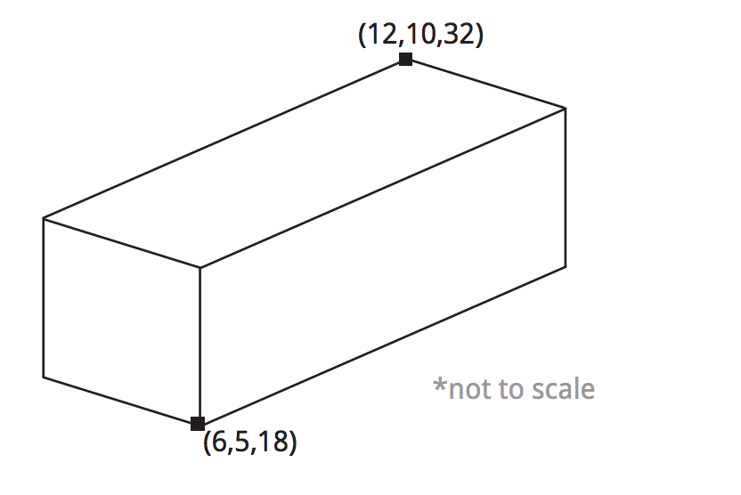
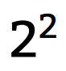
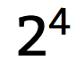

## 第四章：数学操作

还记得上一章你学会了如何声明变量吗？知道如何用变量做些事情才是真正有用的，不是吗？

这正是数学操作的用处：与变量一起做些真正有用的事情。特别是与整型和浮点型变量。

从数学里你学到了加减乘除。其中每一项都被称作一个操作。Python支持所有这些操作，甚至更多。

操作是极其有用的，理解他们将使编程变得更容易。

别担心你的数学不是很好。只要你能理解非常基本的知识，比如加减，那么你就没有问题。如果你想获得数学上的额外支持，可汗学院有很多易于理解优秀的教程，可以让你按自己的节奏学习。

#### 4.1 Minecraft练习

让我们跟数学操作相处的更舒服一些。这里的一系列练习，会依赖本章和上一章的知识。我们将告诉你如何用Python在Minecraft里创建块。这使快速建造复杂的建筑，变得非常容易。

理解数学操作，能够很好的完成这点。

就像之前的练习，第一道习题，我们会给很多的支持，然后逐渐让你用自己的知识来完成开发。

##### 4.1.1 堆砌块

-----------------------------------

**知识与技巧**

本练习中，我们将练习的知识和技巧:

* 整数
* 创建块
* 加法

-----------------------------------

我们用setBlock()在Minecraft中创建块。类似于setPos() 和setTilePos()，setBlock() 用 x, y,z的值定位坐标。除此之外，它还有第四个值：块类型。这个值代表了游戏中不同的块，例如：草、岩浆、甜瓜。每钟类型的块都有一个与之对应的整数来代表它。例如 草的值是2，空气的值是0，水是8，甜瓜是103。完整的对应列表看这里[在哪里啊？？？]。

使用setBlock()，要把我们设置的值都放在括号里，包括我们希望放置块的坐标，x、y、z三个数，以及我们希望建造的块类型。之上每个数都用逗号（，）分隔。例如，我们希望放置甜瓜块到坐标(6, 5, 28)的代码：

	1.	import mcpi.minecraft as minecraft
	2. mc = minecraft.Minecraft.create()
	3. 
	4. mc.setBlock(6, 5, 28, 103)

很简单。当然你可以用变量替换括号中的值，获得相同的效果，像这样:

	1. import mcpi.minecraft as minecraft
	2.	mc = mi
	3. 
	4. x = 6
	5. y = 5
	6. z = 28
	7. blockType = 103
	8. mc.setBlock(x, y, z, blockType)

在这段代码里，我们创建了代表放置块的坐标的变量，也创建了代表块类型的变量。然后我们把这些变量赋给了setBlock()，接着Minecraft就展示了他的神奇。

当我们把数学操作加进来的时候，你就能做更酷的事情了。 让我们开始做一些简单的事情，创造一堆块。

**指令**

这里有些简单的代码，来创建两层块:

	1. import mcpi.minecraft as minecraft
	2. mc = minecraft.Minecraft.create()
	3. 
	4. x = 6
	5. y = 5
	6. z = 28
	7. blockType = 103
	8. mc.setBlock(x, y, z, blockType)
	9. 
	10. y = y + 1
	11. mc.setBlock(x, y, z, blockType)

上面的代码你应该比较熟悉。第10行的不同之处是给y加了1。然后我们在第11行，用了与第8行相同的代码创建了一个新块。因为是给y加1，所以第二个块在y轴上的位置要高于第一块。

你的任务是在当前两块的顶部再增加两个块。因此，当你运行代码后，应该有4个块叠在一起。

**扩展练习**

* 改变块的类型
* 改变两块之间的增幅
* 改变方向建造一个正方形
* 发挥你的想象，做些其他酷的事情

##### 4.1.2 超级跳

-----------------------------------

**知识与技巧**

本练习中，我们将练习的知识和技巧:

* 加法操作

-----------------------------------

通过上一章的练习，我们学会了如何改变玩家的位置。在这个练习里我们将走的更远。首先，我们找出玩家所在的位置，然后通过加减法操作，把它移动几个块的距离。

找出玩家的位置，我们用getTilePos()。例如，我们可以找出玩家的坐标，然后把坐标值赋给x，y，z这三个变量，代码如下：

	1. import mcpi.minecraft as minecraft
	2. mc = minecraft.Minecraft.create()
	3. 
	4. position = mc.player.getTilePos()
	5. x = position.x
	6. y = position.y
	7. z = position.z

如果我们想要玩家沿着x轴移动-5个块，我们可以增加如下代码：

	8. x = x - 5
	9. mc.player.setTilePos(x, y, z)

**指令**

你的任务是从当前位置向空中跳10个块的高度。你可以直接修改上面的代码。

**扩展练习**

* 跳向空中后，在玩家下面增加一个块
* 修改代码，让玩家看起来是被下面一堆的块抬到了空中

##### 4.1.3 在玩家下方放置块

-----------------------------------

**知识与技巧**

本练习中，我们将练习的知识和技巧:

* 减法操作
* 自加自减运算符

-----------------------------------

现在是你亲自做的时候了。在这个练习里，你将改变玩家下方的块。为了实现这点，你需要用到getTilePos()和setBlock()。

**指令**

用下面的注释做指南，编写代码，在玩家的下方设置块。你将学到如何获取玩家的位置以及放置块。

试着在这个练习中使用自加自减运算符。在这里你可以发现自加自减运算符的更多信息【这里放速记操作符的信息】

这段注释给出了代码的结构：

	1. # connect to Minecraft
	2. # get the player’s position
	3. # define x,y,z variables to store the player’s position
	4. # define the block type
	5. # set y to one block below the player’s postion
	6. # set a block

**扩展练习**

* 修建一个环绕玩家的建筑

##### 4.1.4 快速建造

-----------------------------------

**知识与技巧**

本练习中，我们将练习的知识和技巧:

* 加法
* 减法
* 操作符顺序

-----------------------------------

我们用 setBlock()一次创建一个块。 setBlock()还有一个伙伴：Blocks()。它可以以长方体的形式，一次创建多个块。

setBlocks()在大面积的建筑中是非常有用的，否则一次创建一个块非常耗时繁琐。

使用setBlock()我们需要两组坐标系和使用的块的类型。第一组坐标系是我们想建筑的长方体的一角，第二组坐标是相对的另一角。请看图示：

为创建上面的长方体，我们需要以下代码：

	1. import mcpi.minecraft as minecraft
	2. mc = minecraft.Minecraft.create()
	3. 
	4. x1 = 6
	5. y1 = 5
	6. z1 = 18
	7. x2 = 12
	8. y2 = 10
	9. z2 = 32
	10. blockType = 4
	11. mc.setBlocks(x1, y1, z1, x2, y2, z2, blockType)

这个长方体的长宽高分别是：14，6，5。

**指令**

你的任务是修改这段代码，在玩家的位置上，创建一个空心长方体。换句话说，你需要创建一个由块组成的长方体，然后在这个长方体中间再创建一个由空气块组成的长方体。类似于空的盒子。

上面的代码需要修改，以便加入下列功能:

* 得到玩家的位置
* 把长方体的一角设置成玩家的位置
* 根据玩家的位置设置另外一角
* 空心化整儿长方体

. . . . . . . . . . . . . . . . . . . . . . . . . . . . . . . . . . . . . . . . . . . . . . . . . . . . . . . . . . . . .

**警报箱**

**注意**: 分阶段构建和测试这个练习。首先取得长方体一角的玩家的位置。再利用玩家的位置，计算出对面一角的坐标。最后，再使用加减法，算出中间空气块长方体的坐标。

. . . . . . . . . . . . . . . . . . . . . . . . . . . . . . . . . . . . . . . . . . . . . . . . . . . . . . . . . . . . .

**扩展练习**

这段代码真的能够帮助建造。看看你是否能增加一些额外的代码，来实现以下目的:

* 增加额外的层
* 把地板换成木头
* 用门增加一个入口
* 用墙分隔出两个房间

##### 4.1.5 比例

-----------------------------------

**知识与技巧**

本练习中，我们将练习的知识和技巧:

* 乘法
* 除法

-----------------------------------

我们将用简单的任务结束这一章的练习。我们将会重用前一组练习的代码创建一个建筑，但是它的长宽高会按比例变化。

**指令**

拷贝并修改前一组练习的代码，实现如下功能：

* 建筑的长是宽的两倍
* 建筑的高是宽的一半

#### 4.2 操作符，表达式，语句

编写代码的时候，知道操作符，表达式，语句之间的差别，是很重要的。

操作符的目的是对变量做些什么。例如，相加操作符，是为了加和两个变量的值。

表达式是小的代码片段，它能被用在很多地方，但它不能做任何事情，除非他是语句的一部分。例如2+2就是个表达式。

语句是你程序中的独立一行，或者一块，它能够做些什么。语句包括了表达式、变量和操作符。例如：people = 2 + 2。

当介绍一个新的Python概念时，我们会列出它的表达式，以便你能理解它最基本的形式。我们也会给出它在语句中使用的示例，这样你就能明白它是如何被使用的。

##### 4.2.1 加

我非常确定你会加法。Python也会。

在Python里使用加法表达式与数学中的用法是一样的，都使用 + （加号）。使用加法操作符与声明变量是相似。

. . . . . . . . . . . . . . . . . . . . . . . . . . . . . . . . . . . . . . . . . . . . . . . . . . . . . . . . . . . . .

**加 +**

*操作符*

加法操作符将两个值相加。

**表达式**

	1. number1 + number2

**语句**

	1. pizzas = 2 + 1

. . . . . . . . . . . . . . . . . . . . . . . . . . . . . . . . . . . . . . . . . . . . . . . . . . . . . . . . . . . . .

例如：我们有两只鞋，我们又买了另外一双：

	1. shoes = 2 + 2

你能猜出例子中，shoes变量的值吗？如果你回答4，那么你是正确的。Python会将右边计算的结果，赋值给左边的变量。

. . . . . . . . . . . . . . . . . . . . . . . . . . . . . . . . . . . . . . . . . . . . . . . . . . . . . . . . . . . . .

**警报箱**

**注意**: 在你的程序中使用加法运算符或其他运算符时，记得要写整条语句，而不只是表达式。

. . . . . . . . . . . . . . . . . . . . . . . . . . . . . . . . . . . . . . . . . . . . . . . . . . . . . . . . . . . . .

##### 4.2.2 减法

减法与加法相似。只不过把加号换成了减号。

. . . . . . . . . . . . . . . . . . . . . . . . . . . . . . . . . . . . . . . . . . . . . . . . . . . . . . . . . . . . .

**减 -**

*操作符*

从一个数里减去另一个数。这个 - 操作符用于两数相减。

**表达式**

	1. number1 - number2

**语句**

	1. pizzas = 2 - 1

. . . . . . . . . . . . . . . . . . . . . . . . . . . . . . . . . . . . . . . . . . . . . . . . . . . . . . . . . . . . .

设想我们丢失了一只鞋：

	1. shoes = 4 - 1

shoes现在的值就是3。类似与加法，Python会将等号右边计算的结果，赋值给等号左边的变量。其他操作符也是这样的。

##### 4.2.3 乘法

乘法操作符和数学中使用的符号不同。在Python中乘法使用 * ，而不是 X。

除了符号不一样，Python中的乘法和数学里的，都是一样的。在Python里，2*2仍然等于4。

停在我们房子外的车已经翻倍了。在Python中我们可以这样表示：

	1.	cars = 4 * 2

例子中，变量cars的值是8。这段代码是4乘以2。

. . . . . . . . . . . . . . . . . . . . . . . . . . . . . . . . . . . . . . . . . . . . . . . . . . . . . . . . . . . . .

**乘法  \* **

*操作符*

乘法操作符使两数相乘。这个 * 操作符被用在两个乘数之间。

**表达式**

	1. number1 * number2

**语句**

	1.	seats = 6 * 9 # answer of 54

. . . . . . . . . . . . . . . . . . . . . . . . . . . . . . . . . . . . . . . . . . . . . . . . . . . . . . . . . . . . .

##### 4.2.4 除法

Python中的除法符号，不是 ÷  ，而是一个 / 。

类似于数学，你需要吧被除数放在 / 符号的左边，把除数放在 / 的右边。

. . . . . . . . . . . . . . . . . . . . . . . . . . . . . . . . . . . . . . . . . . . . . . . . . . . . . . . . . . . . .

**乘法  / **

*操作符*

一个数除以另一个数。这个 / 操作符被用在两个数之间。被除数放在 / 符号的左边，除数放在 / 的右边。

**表达式**

	1. number1 / number2

**语句**

	1. hair = 4 / 2 # answer of 2

. . . . . . . . . . . . . . . . . . . . . . . . . . . . . . . . . . . . . . . . . . . . . . . . . . . . . . . . . . . . .

街上一半的车都开走了。这儿曾经有8辆车。Python中，我们这样表现：

	1. cars = 8 / 2

cars的值是4。8除以2。

##### 4.2.5 指数

指数是一个数自己乘自己的次数。

你熟悉的指数是这样写的
这代表2乘自己2次。
这代表2乘自己4次。

在计算中指数是非常重要的。所有的计算机系统都使用二进制工作，它是由2的幂组成的。你以后会学到关于二进制更多的知识。

在Python里，使用 ** 作为指数运算的符号。被操作的数本身放在  ** 的左边，你希望他自身相乘的次数放到 ** 的右边，例如： 2**2。

. . . . . . . . . . . . . . . . . . . . . . . . . . . . . . . . . . . . . . . . . . . . . . . . . . . . . . . . . . . . .

**指数  \*\* **

*操作符*

一个数对另一个数的乘方。这个** 操作符被用在两个数之间。被操作的数本身放在  ** 的左边，你希望他自身相乘的次数放到 ** 的右边。

**表达式**

	1. number ** toThePowerOf

**语句**

	1. e.g. cube = 2 ** 3
	2. # 2的3次方，等于8
	3. 
	4. square = 4 ** 2
	5. # 4的2次方，等于16

. . . . . . . . . . . . . . . . . . . . . . . . . . . . . . . . . . . . . . . . . . . . . . . . . . . . . . . . . . . . .

我们需要放置4组4行4列的椅子。需要的椅子就是4*4*4，也就是是4的3次方。对应的代码就是：

	1. chairs = 4 ** 3

我们的答案应该是 4*4是16，16*4是64。所以我们需要64把椅子。

##### 4.2.5 模数

模运算符可以得到两个整数相除的余数。例如7除以3得2（2*3=6），余1（7 - 6
= 1）。因此，7/3的模数是1。

如果一个数能被完全除尽，例如4除以2等于2，余0，那么4/2的模数就是0。

当你刚开始学习除法的时候，你可能会说，6除以4等于1余2。都是一个意思。

. . . . . . . . . . . . . . . . . . . . . . . . . . . . . . . . . . . . . . . . . . . . . . . . . . . . . . . . . . . . .

**模数 %**

*操作符*

计算一个数除以另一个数的余数。这个 %  操作符被用在两个数之间。被除数放在  % 的左边，除数在 %  的右边。

**表达式**

	1. number % toThePowerOf

**语句**

	1. barrels = 10 % 2 # 结果是 0
	2. pigeons = 13 % 5 # 结果是 3

. . . . . . . . . . . . . . . . . . . . . . . . . . . . . . . . . . . . . . . . . . . . . . . . . . . . . . . . . . . . .

我们买了7块巧克力，要分享给3个人。没有分享出去的会留给你的表兄。下面的代码显示了你表兄得到的部分：
	
	1. pieces = 7 % 3

7块巧克力分享给3个人，那么每人2块，还剩余1块 (3* 2 = 6, 7 - 6 = 1)。所以答案是1。

#### 4.3 操作符优先级

几个数学运算符可以一起使用。例如，5乘2，再减去1，对应的代码如下：

	1. turtles = 5 * 2 - 1 #结果是9

. . . . . . . . . . . . . . . . . . . . . . . . . . . . . . . . . . . . . . . . . . . . . . . . . . . . . . . . . . . . .

**警报箱**

**注意**: 当混合使用数学操作符时，Python将从左向右执行。所以，你是否能得到期望的结果，这个顺序很重要。

唯一的例外是指数操作符。指数操作符总是先于其他操作符被执行。

. . . . . . . . . . . . . . . . . . . . . . . . . . . . . . . . . . . . . . . . . . . . . . . . . . . . . . . . . . . . .

我们使用括号()，改变操作符的执行顺序。任何括号中的操作符将优先执行。例如：

	1.	eggs = 6 * 3 - 2

得到的值是16，如果加上括号... 

	1. eggs = 6 * (3 - 2)

得到的值是6。

#### 4.4 交换变量和值

只要你设置一个值，你就需要设置一个变量。
例如，有4个房子，每个房子里有5只猫。你可以计算出猫的数量，像这样：

	1.totalCats = 5 * 4

然而，如果每个房子里猫的数量经常变化呢？你可能会在代码里多次直接使用5这个数，但当需要修改它时，你需要在代码里修改多次，这会使修改变得繁琐而且困难。

有一个简单的方式。你用变量来代替这两个数字，或其中的一个。

	1. catsPerHouse = 5
	2. totalCats = catsPerHouse * 4

房间数也可以使用变量, 像这样:
	1. catsPerHouse = 5
	2.	houses = 4
	3. totalCats = catsPerHouse * houses

你也可以让一个变量的值，等于其他变量的值，像这样：
	1.	cats = 5
	2. oldCats = cats

这样，两个变量就有了相同的值5。你会发现者很有用。当你想改变一个变量的值，但是旧的值仍然被用在很多地方。当改变一个值时，不会影响另一个:
	1. cats = 5
	2. oldCats = cats #oldCats 现在是 5
	3. cats = 6
	4. #oldCats 仍然是 5

#### 4.5 速记操作符

很多时候，你希望操作某个变量，然后再把执行后的结果，存回同一个变量。例如，你想把一个变量值加5：

	1. horses = 6
	2. horses = horses + 5 #现在horses的值是11

程序员都喜欢用最简单的方式达成目的，希望能尽量减少重复。所以速记符应运而生。

在Python中速记操作符用在，先对变量做数学操作，然后把结果再赋给同一变量的场合。

有四种速记操作符:

* 加 (+=)
* 减 (-=)
* 乘 (*=)
* 除 (/=)

我们可以用速记操作符重写上面的代码:
	1. horses = 6
	2. horses += 5 # 这时horses的值是11

. . . . . . . . . . . . . . . . . . . . . . . . . . . . . . . . . . . . . . . . . . . . . . . . . . . . . . . . . . . . .

**速记操作符**

*操作符*

速记操作符用在先对变量做数学操作，然后把结果再赋给同一变量的场合。有四种数学速记操作符：加 (+=)，减 (-=)，乘(*=) ，除(/=)。变量在操作符的左边，操作数在操作符的右边。

**表达式**

1 variable += value #加
2 variable -= value #减
3 variable *= value #乘
4 variable /= value #除

**语句**

1 shoes = 5
2 shoes += 1 # 值是6
3 shoes -= 2 # 值是4
4 shoes *= 2 # 值是8
5 shoes /= 2 # 值是4

. . . . . . . . . . . . . . . . . . . . . . . . . . . . . . . . . . . . . . . . . . . . . . . . . . . . . . . . . . . . .
