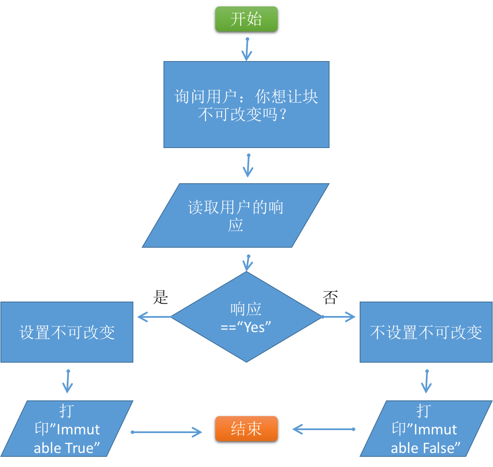
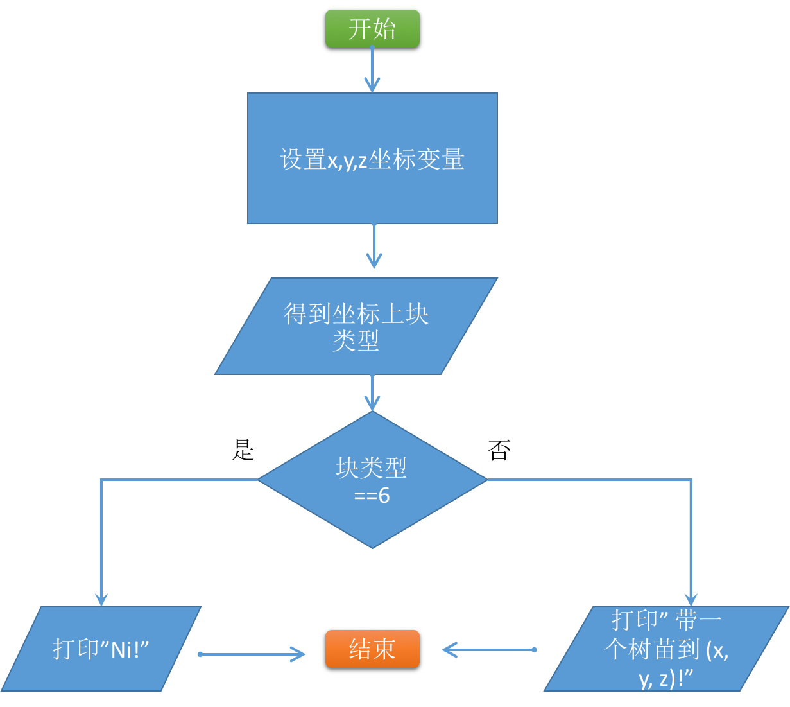
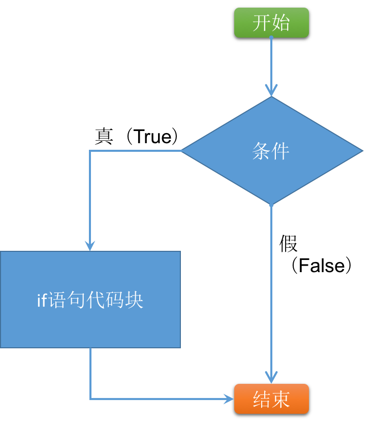
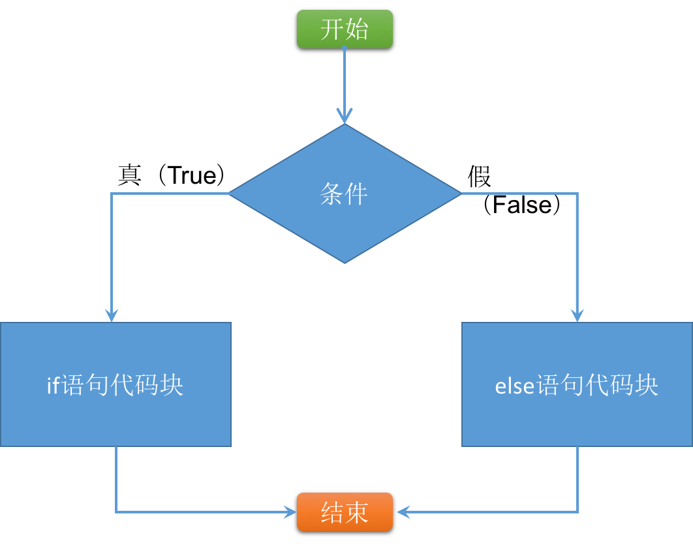

## 第6章：比较运算符与流程控制

在日常生活中，做决定是非常重要的。如果外面很冷，你就不会穿短裤，你穿外套。如果你饿了，就会吃点东西。我们根据条件做决定。而程序也可以根据条件做决定。

在Python中，一般用“流程控制”来决定是否执行一段代码。这使我们可以根据条件改变代码的行为。例如，当用户输入的类型不正确的时候，就可以显示一段警告提示，或者在创建的库存系统中，当某个货物数量少于5时，提示用户进货。

在这一章里，我们首先将了解比较运算符和二元运算符，在判定条件是否为真或假（True or False）的时候需要它们。接着，我们将会介绍if语句，它可以根据条件的真假，决定是否执行代码块。

#### 6.1 Minecraft练习

比较运算符和if语句，在Minecraft中是非常有用的。

##### 6.1.1 游泳

-----------------------------------

**知识与技巧**

本练习中，我们将练习的知识和技巧:

* 相等比较符
-----------------------------------

我们要编写一段程序，判断玩家是否在水里。我们要使用比较运算符来完成它。然后结果将被发送到Minecraft聊天窗口里。

我们使用getBlock()函数找出特点坐标上的块的类型。这个函数需要坐标的三个值做参数，返回整数类型的块类型。例如下面的代码：

	1. blockType = mc.getBlock(10, 18, 13)

如果这个坐标(10, 18, 13)上的块的类型是甜瓜（值是109），那么变量blockType的值就是109。

**指令**

用下面的步骤创建程序：

* 创建一个变量存储玩家的位置。
* 创建一个变量，用getBlock()函数，存储玩家所在坐标的块类型。给这个变量命名blockType。
* 使用相等比较操作符（==）来比较这个blockType值是否等于9（这是水的块类型）。存储这个比较结果在变量swimming里。
* 这个变量swimming打印在聊天窗口里。

如果玩家在水里，聊天窗口将会显示True。如果玩家不在水里，聊天窗口显示False。

试着改变聊天窗口里的消息，让这句话变得更友好一些。

. . . . . . . . . . . . . . . . . . . . . . . . . . . . . . . . . . . . . . . . . . . . . . . . . . . . . . . . . . . . .

**警报箱**

**注意**: 目前你还不能实时的获得结果。想获得一次结果，就得运行一次程序，这一章的练习都是这样。我们将在介绍循环的章节里，更新这个程序，使我们能实时的获得结果。
. . . . . . . . . . . . . . . . . . . . . . . . . . . . . . . . . . . . . . . . . . . . . . . . . . . . . . . . . . . . .

**扩展练习**

如果你想继续这个练习，可以完成下面的扩展练习：

* 判断玩家是否站在树上

##### 6.1.2 你是否想停止打碎东西？

-----------------------------------

**知识与技巧**

本练习中，我们将练习的知识和技巧:

* 输入
* 等于
* if语句
* 不可变更的块
* else语句

-----------------------------------

还记得第一章吗？我们写了个程序，阻止玩家打碎块。换句话说，我们使块不能被改变。这个程序是有用的，它能保护我们珍贵的建造作品，避免毁于事故以及汪达尔人的破坏（汪达尔人？？）。虽然有用，但是这个程序也有点麻烦，当你想关掉“不可变更”时，你需要再写一个程序来做这事。

使用if 和else语句，我们可以开发一个程序，通过命令行输入，来控制“不可变更”功能的开关。我们的程序，将询问你，是否要使块不可变更，然后依据你的回答，设置“不可变更”功能是Ture，还是False。

**指令**

在这个练习里，我们将向你介绍，用流程图来设计程序。你将学习流程图在这一章里【章节号】。

我们将通过流程图，给你介绍程序里的每一步：

1. “开始”在流程图的最上面，它的意思是程序开始。沿着箭头走到下一个线框。
2. 矩形框代表一个过程，在这个例子里，就是进行询问。
3. 下一个线框是输入，在这个例子里，我们将得到用户对问题的回答。这个步骤和上面的步骤，可以在写Python代码的时候，合在一起：

	4. response = raw_input(”Do you want blocks to be immutable?”)

4. 接下来这个线框是一个条件判断，看用户的回答是否是”yes“。
5. 如果判断是真(True) ，那么我们沿着被标记是True的部分执行。
6. 这个步骤就设置“不可变更”是Ture。
7. 然后我们把当前的“不可变更”是Ture，这个事实告诉用户。4-7步，可以用if语句实现：
	
	5. if response == ”True”:
	6. mc.setting(”world_immutable, True)
	7. mc.postToChat(”World is immutable”)

8. 回到第4部，比较的部分，如果比较结果是否（False），那么我们就设置“不可变更”（immutable）为False。然后把这个结果告诉用户。被设置成False的流程，可以用else语句实现：

	8. else:
	9. mc.setting(”world_immutable, False)
	10. mc.postToChat(”World is mutable”)

拷贝这段代码，再加上连接Minecraft的代码，就变成可运行的程序了。

**扩展练习**

你可能已经注意到了，输入一些无意义的信息，比如"banana"，会得到和输入"No"一样的结果。扩展if语句，处理不正确的输入：加入一个elif语句处理输入"No"的情况，同时为了得到正确的输入，修改else的代码。

使用布尔运算符使程序能够接收不同形式的"Yes"和"No"，比如小写的"yes"，大写的"YES"，以及单个字母"Y"。

##### 6.1.3 带给我们树苗

-----------------------------------

**知识与技巧**

本练习中，我们将练习的知识和技巧:

* if语句	
* else语句
* 相等操作符
* 块类型
* 系统建模（System modelling）

-----------------------------------

收集某些物品，然后把他们带到摸个地方，这是一些视频游戏的玩法。我们将创建一个简单的游戏，检查某些块上是否一个树苗放在它上面。

**指令**

按照流程图中的说明操作。

一个简单的提示，第一步，你需要找到一个舒服的位置，用这个位置的坐标设置x,y,z的值。还有，树苗的类型值是6。并且，确保你设置的坐标值是正确的；否则你花费了大量时间才发现，程序不能正确工作的原因是没有设置正确的x值。程序中剩下的部分，可以用你学过的代码实现。

**扩展练习**

检查不同块的类型，比如钻石。
改变if语句的做些其他事情，比如把地上的块改成岩浆，或者造个房子。
利用布尔型判断的OR 操作符，把叶子（块类型是18）等同与树苗。
利用elif语句，接收更多的块类型，做不同的响应。

##### 6.1.4 去洗澡

-----------------------------------

**知识与技巧**

本练习中，我们将练习的知识和技巧:

* 大于等于
* 小于等于
* if语句
* else语句

-----------------------------------

最棒的Minecraft房子有很多值得注意的细节。很多人会修建木质地板，壁炉，画，这样让他们的房子更有家庭氛围。你将按照下面的步骤，建造一个可以工作的淋浴。

**指令**

在地上创建一个3 X 4块区域做浴室。使用if语句，用小于等于(<=)和大于等于(>=)比较运算符判断，用户是否在浴室里。如用户在浴室里，就在几个块上创建水块，如果用户不在浴室里就停止出水。【水，就是水块吗？】

**扩展练习**

* 如果玩家在门板上面，就自动打开门板。【怎么打开门板？】

##### 6.1.5 秘密通道

-----------------------------------

**知识与技巧**

本练习中，我们将练习的知识和技巧:

* 大于 >
* 小于 <
* 不等于 != 
* and操作符
* or操作符
* if语句
* elif 语句
* else 语句

-----------------------------------

在很多视频游戏里，某个特殊物品能够打开一个秘密通道。这些特殊物品通常被放置在被称作柱基的小台子上。在这个练习里，我们将创造秘密通道，当钻石被放到柱基的时候，它就能打开。如果其他的块被放到了柱基上，地板将会变成岩浆。

**指令**

建造一个长方体的建筑，这个建筑有一个入口，还有一个秘密的房间在墙后面。在入口外面建一个块，代表柱基。

用大于、小于比较运算符，判断玩家是不是在建筑内。

当玩家进入建筑的时候：

* 如果玩家在房子里，而且钻石在柱基上，打开通往密室的秘密通道。（把块换成空气块）。
* 如果玩家在房子里，但柱基上的不是钻石，那么让地板变成岩浆。提示：确认柱基上的块，既不是钻石，也不是空气。
* 如果玩家在房子里，但柱基上没有东西，就在聊天窗口打印“给我们些有价值的东西”。

这是一个更复杂的程序，分阶段编写它，然后在测试它。运行之前，确保程序的每个部分都是正常的。这将让调试变得容易些。

寻找bug。按顺序，把不同条件的代码都测试到。

#### 6.2 比较操作符

甚至在没有计算机的时候，我们就非常善于比较事情。我们知道5比2大，8和8是一样的数，6和12是不一样的。

在Python中比较运算符被用来比较数据。Python中有六种比较运算符：

	* 相等 (==)
	* 不相等 (!=)
	* 小于 (<)
	* 小于等于 (<=)
	* 大于 (>)
	* 大于等于 (>=)

比较操作符放在两个被比较的数字之间。例如，我们比较两个数字是否相等：

	1. 8 == 2

每个比较运算符都会返回一个布尔型的值，来表示条件是否成立。比较运算符返回的布尔型可以用在任何你能用布尔型的地方。继续阅读，看看我们是如何使用的。

##### 6.2.1 相等

. . . . . . . . . . . . . . . . . . . . . . . . . . . . . . . . . . . . . . . . . . . . . . . . . . . . . . . . . . . . .

**相等 ==**

*操作符*

这个操作符验证两个值是否一样。一样时返回布尔型值True，不同时返回False。

**表达式**

	1. value1 == value2

**语句**

	1. triforce = 3
	2. hasTriforce = triforce == 3 # value of True
	3. hasTriforce = triforce == 2 # value of False

. . . . . . . . . . . . . . . . . . . . . . . . . . . . . . . . . . . . . . . . . . . . . . . . . . . . . . . . . . . . .

当你想判断一个值是否与另一个值相等时，你可以使用相等操作符。相等操作符比较两个数值，如果相等返回Ture，如果它们不同则返回False。

例如：

	1. length = 2
	2. width = 2
	3. square = length == width #value of True

变量width和length的值相等的时候，square的值是Ture。如果他们不同，我们会得到False：

	1. length = 4
	2. width = 1
	3. square = length == width # value of False

相等操作符可以用在任何数据类型上：字符串，整型，浮点型，布尔型。

. . . . . . . . . . . . . . . . . . . . . . . . . . . . . . . . . . . . . . . . . . . . . . . . . . . . . . . . . . . . .

**警报箱**

**注意**: 要注意到比较操作符用的是==而不是=。=是用来给变量赋值的。记住这个区别，即使是很好的程序员，每过一段时间仍然可能犯这个错误。

. . . . . . . . . . . . . . . . . . . . . . . . . . . . . . . . . . . . . . . . . . . . . . . . . . . . . . . . . . . . .

##### 6.2.2 不相等

. . . . . . . . . . . . . . . . . . . . . . . . . . . . . . . . . . . . . . . . . . . . . . . . . . . . . . . . . . . . .

**不相等 !=**

*操作符*

这个操作符验证两个值是否不同。不同时返回布尔型值True，相同时返回False。

**表达式**

	1. value1 != value2

**语句**

	1. cakes = 5
	2. enoughCakes = cakes != 5 # value of False
	3. enoughCakes = cakes != 6 # value of True

. . . . . . . . . . . . . . . . . . . . . . . . . . . . . . . . . . . . . . . . . . . . . . . . . . . . . . . . . . . . .

不相等操作符的作用和相等操作符相反。它不是判断是否相等，二是判断是否不同。当两个值不同时，返回True，相同时返回False。

矩形是长宽不同的四边形。下面第三行，比较了长宽，看是否是我们想要的形状：

	1. width = 3
	2. length = 2
	3. rectangle = width != length #value of True

这个例子中，rectangle的值是Ture，因为长宽不同。如果相同的话，比较操作符会返回False：

	1. width = 3
	2. length = 3
	3. rectangle = width != length #value of False

可以使用不相等比较操作符的数据类型还有：字符串、整型、浮点型、布尔型等。

##### 6.2.3 小于

. . . . . . . . . . . . . . . . . . . . . . . . . . . . . . . . . . . . . . . . . . . . . . . . . . . . . . . . . . . . .

**小于 <**

*操作符*

小于操作符比较两个值，验证是否第一个值小于第二个值。如果左边的值大于右边的值，或者两个值相等，返回False。

**表达式**

	1. value1 < value2

**语句**

	1. cakes = 5
	2. enoughCakes = cakes < 5 # value of False
	3. enoughCakes = cakes < 4 # value of False
	4. enoughCakes = cakes < 6 # value of True

. . . . . . . . . . . . . . . . . . . . . . . . . . . . . . . . . . . . . . . . . . . . . . . . . . . . . . . . . . . . .

小于比较操作符用于比较一个值是否小于另一个。如果左边的值小于右边的值，返回Ture。如果左边的值大于右边的值，或者两个值相等，返回False。

一个卡车过桥时需要知道它的重量是否小于桥的最大载重：

	1. vanHeight = 8
	2. bridgeHeight = 12
	3. willPass = vanHeight < bridgeHeight
	4. # Value of True

这个例子中，卡车可以安全通过，因为它的重量小于桥的最大载重：8小于12。在后面的旅途中，这辆卡车又遇到了另一座载重较小的桥，这次卡车就无法安全通过了：

	1. vanHeight = 8
	2. bridgeHeight = 7
	3. willPass = vanHeight < bridgeHeight
	4. # Value of False

小于比较操作符不用于字符串的比较，但是可以用于整型、浮点型、布尔型。

##### 6.2.4 小于等于

. . . . . . . . . . . . . . . . . . . . . . . . . . . . . . . . . . . . . . . . . . . . . . . . . . . . . . . . . . . . .

**小于等于 <=**

*操作符*

小于等于操作符比较两个值，验证是否第一个值小于或者等于第二个值。如果左边的值小于右边的值，或者两个值相等，则返回True。

**表达式**

	1. value1 <= value2

**语句**

	1. cakes = 5
	2. enoughCakes = cakes <= 4 # value of False
	3. enoughCakes = cakes <= 5 # value of True
	4. enoughCakes = cakes <= 6 # value of True

. . . . . . . . . . . . . . . . . . . . . . . . . . . . . . . . . . . . . . . . . . . . . . . . . . . . . . . . . . . . .

这个操作符使用起来有点像小于操作符。它会验证左边的值是否会小于或者等于右边的值。

小于等于操作符和小于操作符的不同在于，当两数相等的时候，前者返回Ture，而后者返回False。

我们给一群人展示我们惊人的程序。我们的房间里只有30把椅子。我们写一个程序，检查一下，我们是否有足够的椅子给想要参加的人：

	1. seats = 30
	2. people = 30
	3. enoughSeats = people <= seats
	4. # Value of True

这个例子里，人数和椅子数刚刚好，所以变量enoughSeats的值是Ture，如果参加的人变少了，我们的椅子也是足够的。现在多出了5个人，想要看看我们惊人的程序：

	1. seats = 30
	2. people = 35
	3. enoughSeats = people <= seats
	4. # Value of False

不幸的是，现在变量enoughSeats的值是False，已经没有足够的椅子给新来的人了。

这个操作符不能比较字符串，但是可以比较整型，浮点型，布尔型。

##### 6.2.5 大于

. . . . . . . . . . . . . . . . . . . . . . . . . . . . . . . . . . . . . . . . . . . . . . . . . . . . . . . . . . . . .

**大于 >**

*操作符*

大于操作符比较两个值，验证是否第一个值大于第二个值。如果左边的值大于右边的值，则返回True。

**表达式**

	1. value1 > value2

**语句**

	1. seeds = 6
	2. surplusSeeds = seeds > 5 #value of True
	3. surplusSeeds = seeds > 6 #value of False
	4. surplusSeeds = seeds > 7 #value of False

. . . . . . . . . . . . . . . . . . . . . . . . . . . . . . . . . . . . . . . . . . . . . . . . . . . . . . . . . . . . .

当你需要检验一个值是否大于另一个值的时候，你需要用到大于比较符。

当左边的值大于右边的值时此操作符返回Ture，当相等或小于时返回False。

我们的机器人起重的限制是100个香蕉。他抬不起超过99个香蕉的重量。只要我们的机器人的起重限制大于要抬起的香蕉数，那它就一定能抬起来：

	1. limit = 100
	2. bananas = 99
	3. canLift = limit > bananas
	4. # value of True

现在变量canLift的值是True。很棒，我们的机器人能够抬起来：100大于99。看来有人又加了一个香蕉：

	1. limit = 100
	2. bananas = 100
	3. canLift = limit > bananas
	4. # value of False

哦，不，现在达到限制了。canLift的值现在是False，100并不比100大，而是相等。我们的机器人不能举起这些香蕉。

这个操作符不能比较字符串，但是可以比较整型，浮点型，布尔型。

##### 6.2.6 大于等于

. . . . . . . . . . . . . . . . . . . . . . . . . . . . . . . . . . . . . . . . . . . . . . . . . . . . . . . . . . . . .

**大于等于 >=**

*操作符*

大于操作符比较两个值，验证是否第一个值大于第二个值，或者是否相等。如果左边的值大于右边的值，或者两个值相同，则返回True。

**表达式**

	1. value1 >= value2

**语句**

	1. seeds = 6
	2. surplusSeeds = seeds >= 5 #value of True
	3. surplusSeeds = seeds >= 6 #value of True
	4. surplusSeeds = seeds >= 7 #value of False

. . . . . . . . . . . . . . . . . . . . . . . . . . . . . . . . . . . . . . . . . . . . . . . . . . . . . . . . . . . . .

大于等于操作符和大于操作符有点类似，都是判断一个值是否比另一个值大。不同的是，如果两个值相同，大于等于操作符返回Ture，而大于操作符返回False。

参加我们惊人程序发布会的人，都会收到一张我们发出的贴纸。我们需要检查，是否有足够多的贴纸给每一个来的人：

	1. stickers = 30
	2. people = 30
	3. enoughStickers = stickers >= people
	4. # value of True

我们有足够的贴纸：30等于30。如果有人不出席了，我们仍然有足够的贴纸。我们的一个朋友觉得贴纸看起来很酷，也想要一个，这有就有31个人想要贴纸了：

	1. stickers = 31
	2. people = 30
	3. enoughStickers = stickers >= people
	4. # value of False

有点尴尬，我们没有足够的贴纸：30不可能比31大。看起来，我们的朋友不能得到贴纸了。

这个操作符不能比较字符串，但是可以比较整型，浮点型，布尔型。

#### 6.3 布尔操作符

程序中经常需要综合两个或多个比较操作符。你有可能在决策的时候，希望两个条件都能成立，例如：车得是红色的，价格得低于一万欧元。

我们用布尔操作符连接两个或两个以上的比较操作符。这些操作符和两种布尔型（True和False）一起使用，也跟产生两种布尔型的比较操作符一起使用。

这里介绍两种Python中的布尔操作符：

* and
* or

还有第三种布尔操作符：not操作符，它能改变一个布尔型的值。

类似于比较操作符，布尔操作符可以用在任何你想使用布尔型的地方。

布尔操作符，也被称作逻辑操作符。

##### 6.3.1 and

and操作符用在检测是否两个比较表达式同时为True。

若要使有and操作符的表达式为True，则两个比较表达式都必须为True。只要有一个比较表达式返回False，那么整个语句返回False。

下面的表总结了使用and操作符的所有可能性：

|and |True| False|
|--|--|--|
|**True** |True |False|
|**False**| False |False|

我们想要找出大于18岁，并且有私家车的人：

	1. age = 21
	2. ownsCar = True
	3. eligible = age > 18 and ownsCar == True
	4. #value of True

这个年龄大于18岁并且有辆车，所以变量eligible的值是True。如果这两个条件有一个是False，那么整个语句的结果也是False。例如，有人大于18岁，但是没有车：

	1. age = 25
	2. ownsCar = False
	3. eligible = age > 18 and ownsCar == True
	4. #value of False

. . . . . . . . . . . . . . . . . . . . . . . . . . . . . . . . . . . . . . . . . . . . . . . . . . . . . . . . . . . . .

**and**

*操作符*

当它两边的布尔值都是True的时候，此此操作符返回Ture。若两边有一个是False，则此表达式返回False。

**表达式**

	1. boolean1 and boolean2

**语句**

	1. trueStatement = True and True
	2. #OR
	3. name = ”Sam”
	4. age = ”45”
	5. canRegister = name != ”Jim” and age >= 18
	6. #value of True

. . . . . . . . . . . . . . . . . . . . . . . . . . . . . . . . . . . . . . . . . . . . . . . . . . . . . . . . . . . . .

##### 6.3.2 or

这个操作符与and操作符有微妙的区别。只要有比较表达式是True，则有or的表达式返回True。

这就意味这，只有有一个比较表达式是Ture，即使另一个是False，or操作符也依然会返回Ture。当两个比较表达式都不是True的时候，or操作符才会返回False。

下面的表总结了使用or操作符的所有可能性：

|or |True| False|
|--|--|--|
|**True** |True |Ture|
|**False**| True|False|

假设我们想领养一只黑色或者赤黄色的猫，我们可以使用下面的代码：

	1. catColour = raw_input(”What colour is the cat?”)
	2. myCatNow = catColour == ”black” or catColor ==”ginger”
	3. print ”Adopt this cat: ” + str(myCatNow)

只要catColour是”black” 和 ”ginger”中的一个，我们就会领养。为了让myCatNow返回False，catColour既不能是”black” 也不能是”ginger”。所以我们不会领养“blue”色的小猫。

. . . . . . . . . . . . . . . . . . . . . . . . . . . . . . . . . . . . . . . . . . . . . . . . . . . . . . . . . . . . .

**or**

*操作符*

如果任意条件为True，则整个表达式为True。所以，即使另一个条件为False，它也依然返回True。如果两个条件都是False，那么他会返回False。

**表达式**

	1. boolean1 or boolean2

**语句**

	1. trueStatement = True or False
	2. #OR
	3. name = ”Jim”
	4. age = ”32”
	5. canRegister = name != ”Jim” or age >= 18
	6. #value of True

. . . . . . . . . . . . . . . . . . . . . . . . . . . . . . . . . . . . . . . . . . . . . . . . . . . . . . . . . . . . .

##### 6.3.3 not

not操作符不用于and和or操作符。它会把一个布尔型改成相反的值。也就是说，它会把True变成False，反过来也一样。所以：

	1. hungry = **not** True # This is False
	2. sleepy = **not** False # This is True

你可以把not操作符和其他两种一起使用，例如：

	3. timeForBed = **not** hungry and sleepy
	4. #value of True

这个操作符只能放在布尔型的前面。所以上面的例子里，not只是反转了变量hungry。

 . . . . . . . . . . . . . . . . . . . . . . . . . . . . . . . . . . . . . . . . . . . . . . . . . . . . . . . . . . . .

**not**

*操作符*

not操作符把条件改成相反的值。它使Ture变成False，使False变成True。

**表达式**

	1. **not** boolean

**语句**

	1. lights = 1
	2. notEnoughLights = **not** lights > 2
. . . . . . . . . . . . . . . . . . . . . . . . . . . . . . . . . . . . . . . . . . . . . . . . . . . . . . . . . . . . .

##### 6.3.3 布尔操作符优先级

有可能在单条语句中混合多个布尔操作符。例如，你可以像这样，混合 **and**，**or**，**not**：

	1. flying = True and not False or False
	2. #value of True

在上面的例子中**not** False 首先被执行，返回一个Ture。然后 True **and** True被执行，返回Ture。最后再评估 True or False。所以最终的结果是True。

自己在IDLE创建几个布尔操作符的语句，看看结果是否和你预测的一致。

. . . . . . . . . . . . . . . . . . . . . . . . . . . . . . . . . . . . . . . . . . . . . . . . . . . . . . . . . . . . .

**警报箱**

**注意**:布尔操作符在Python中有明确的优先级。如果你记错了顺序，有可能会得到意想不到的的结果。它们的优先级如下：
	1. not
	2. and
	3. or 

. . . . . . . . . . . . . . . . . . . . . . . . . . . . . . . . . . . . . . . . . . . . . . . . . . . . . . . . . . . . .

#### 6.4 If,Else和Elif

你将要学习如何指导计算机作出决定。这听起来或许不是很复杂，但它是非常强大的。

If语句通过判断条件的真假来决定是否执行一段代码。这些条件就是比较操作符语句，所以比较操作符是非常有用的。

##### 6.4.1 if语句

在Python中，if语句可以让计算，根据条件做出决策。

一个if语句包括三部分：一个if操作符，一个条件，一段代码块。

条件和比较操作符语句是一回事情。if语句只在条件为真（True）的时候，执行代码。因此，条件为真（True），if语句的代码块将被执行，然后程序继续执行程序的其他代码。如果条件为假（False），则if语句会跳过代码块，直接执行程序其他代码。

if语句可用流程图表示：

一个冒号和缩进告诉Python，那个是构成if语句的代码块。if操作符的后面跟着条件表达式，条件表达式的后面跟着冒号，这三个都在同一行。这个冒号告诉Python接下来缩进的部分，都是if语句的代码块。

这些代码块在条件为Ture会被执行。代码块有很多行代码，而且他们都是必须是缩进的。

下面这段代码用if语句检查密码是否正确：

	1. password = ”cats”
	2. attempt = raw_input(”Please enter the password”)
	3. if attempt == password:
	4.     print ”Password is correct”

跟在if操作符后面的 attempt == password 是条件判断。第4行缩进的语句 print ”Password is correct” 是组成if语句的代码内容。

这段代码在用户输入与密码相同时打印了“Password is correct”，而不相同时没有向控制台打印任何东西。

 . . . . . . . . . . . . . . . . . . . . . . . . . . . . . . . . . . . . . . . . . . . . . . . . . . . . . . . . . . . .

**if**

*声明*

if语句是告诉计算机，根据条件判断的结果来决定是否执行后面的代码。布尔操作符经常被用在条件部分。缩进部分的代码只在条件为真(True)时执行。如果条件的结果为假（False），则缩进部分的代码不会执行。

**表达式**

	1. if condition:
	2. #body of if statement

**语句**

	1. height = 15
	2. if height >= 12:
	3.     print ”The height is too high”
. . . . . . . . . . . . . . . . . . . . . . . . . . . . . . . . . . . . . . . . . . . . . . . . . . . . . . . . . . . . .

##### 6.4.2 else

if语句仅仅在条件为真的时候，才会做些事情。如果你想让条件为假（False）的时候，也做些事情呢？这正是需要else发挥作用的时候。

else语句与if语句一起使用。当if语句的条件为False时，else会执行一段代码。这可以用下面的流程图总结：

就像if语句，Python里else语句也用冒号和缩进指示属于else语句的代码块。else语句没有自己的条件，它共享if语句的条件。

回到上面的判断密码的例子，当密码不正确的时候，我们可以添加else语句，把这个消息打印出来：

	1. password = ”cats”
	2. attempt = raw_input(”Please enter the password”)
	3. if attempt == password:
	4.     print ”Password is correct”
	5. else:
	6.    print ”Password is incorrect”

如果用户的输入与密码匹配，if条件会返回True，这时会执行if语句的代码块。

如果用户的输入与密码不匹配，if条件将会返回False，这时程序会执行else语句的代码，会在控制台打印出“Password is incorrect”。

. . . . . . . . . . . . . . . . . . . . . . . . . . . . . . . . . . . . . . . . . . . . . . . . . . . . . . . . . . . . .

**警报箱**

**注意**: 没有if语句，else语句不能单独使用。

. . . . . . . . . . . . . . . . . . . . . . . . . . . . . . . . . . . . . . . . . . . . . . . . . . . . . . . . . . . . .

 . . . . . . . . . . . . . . . . . . . . . . . . . . . . . . . . . . . . . . . . . . . . . . . . . . . . . . . . . . . .

**else**

*声明*

else语句和if语句一起使用。如果if语句的条件不匹配，也就是说if语句的条件为False时，else语句的代码被执行。

**表达式**

	1. if condition:
	2.     #body of if statement
	3. else:
	4.     #body of else statement

**语句**

	1. shells = 12
	2. if shells == 32:
	3.     print ”You have all of the shells”
	4. else:
	5.     print ”You need more shells”
. . . . . . . . . . . . . . . . . . . . . . . . . . . . . . . . . . . . . . . . . . . . . . . . . . . . . . . . . . . . .

##### 6.4.3 elif

有些时候，在if条件为False的情况下，你希望还能用if语句做些判断。这时你就需要else if语句，在Python里被简写成elif。一个elif语句有自己的条件语句和代码块。在if语句为Flase，而elif语句条件为True的情况下，elif的代码块会被执行。如果elif条件为False，则最后的else语句会被执行。else语句在这里不是必须存在的。

可以用下面的流程图总结：

举个例子，你需要设计一个程序，监控烤箱的温度，让它维持在理想的温度，也就是200摄氏度。这需要你做三个事情：

* 如果烤箱的温度正好是200度，程序会告诉你这是正确的温度。
* 如果烤箱温度低于200度，程序提醒你加热。
* 如果温度高于200读，程序会要求减少热量。

这里是代码：

	1. ovenTemp = input(”Enter the oven temperature: ”)
	2. desiredTemp = 200
	3. if ovenTemp == desiredTemp:
	4.     print ”Temperature is perfect”
	5. elif ovenTemp > desiredTemp:
	6.     print ”Temperature is too hot”
	7. elif ovenTemp < desiredTemp:
	8.     print ”Temperature is too cold”
	9. else:
	10.     print ”Something weird happened”

这段代码从上到下，判断每个条件。如果if语句和elif语句的条件都不成立，则else语句中的代码会被执行。

. . . . . . . . . . . . . . . . . . . . . . . . . . . . . . . . . . . . . . . . . . . . . . . . . . . . . . . . . . . . .

**警报箱**

**注意**: 只要把elif语句放在if语句的后面，else语句的前面，你可以根据情况，多次使用elif语句。elif不能在没有if语句的情况下使用。

. . . . . . . . . . . . . . . . . . . . . . . . . . . . . . . . . . . . . . . . . . . . . . . . . . . . . . . . . . . . .

 . . . . . . . . . . . . . . . . . . . . . . . . . . . . . . . . . . . . . . . . . . . . . . . . . . . . . . . . . . . .

**elif**

*声明*

在if语句为Flase，而elif语句条件为True的情况下，elif的代码块会被执行。elif必须和if语句一起使用。

**表达式**

	1. if condition:
	2.     #body of if statement
	3. elif condition:
	4.     #body of elif
	5. else:
	6.     #body of else statement

**语句**

	1. shells = 17
	2. if shells == 32:
	3.     print ”You have all of the shells”
	4. elif shells > 16:
	5.     print ”You’ve collected more than half of the shells”
	6. else:
	7.     print ”You need more shells”
. . . . . . . . . . . . . . . . . . . . . . . . . . . . . . . . . . . . . . . . . . . . . . . . . . . . . . . . . . . . .

6.4.4 if语句嵌套

在一个if语句中放入另一个if语句，这是可以的。这被称作if语句嵌套。在有些情况下，这是很有用的。

让我们看一个if语句嵌套的例子。我们有一个简单的自动取款机，它会检查你是否有足够的钱，然后在你提款的时候，要求你确认。请注意嵌套的if语句缩进在第一个if语句的代码块里。

	1. withdraw = input(”How much do you want to withdraw? ”)
	2. balance = 1,000
	3.
	4. if balance >= withdraw:
	5.     confirm = raw_input(”Are you sure you want to withdraw ” + str(withdraw) + ”?”)
	6. 
	7.     if confirm == ”Yes” or confirm == ”y” or confirm == ”yes”:
	8.         print ”Here is your money”
	9.         #some more code to give them the money
	10. else:
	11.     print ”You do not have enough money”

. . . . . . . . . . . . . . . . . . . . . . . . . . . . . . . . . . . . . . . . . . . . . . . . . . . . . . . . . . . . .

**警报箱**

**注意**: else语句和elif语句，可以被嵌套在if语句里。if语句也可以嵌套在else和elif语句里。

. . . . . . . . . . . . . . . . . . . . . . . . . . . . . . . . . . . . . . . . . . . . . . . . . . . . . . . . . . . . .

##### 6.4.5 检查是否是字母

. . . . . . . . . . . . . . . . . . . . . . . . . . . . . . . . . . . . . . . . . . . . . . . . . . . . . . . . . . . .

**isalpha()**

*函数*

isalpha()函数检查一段字符串是否只包含字母。换句话说，不能含有数字或符号。如果字符串只含有字母，isalpha()就返回True，否则返回False

**表达式**

	1. ”cats”.isalpha()  #true

**语句**

	1. ”cats”.isalpha()  #true
	2. ”9 cats”.isalpha()  #false
. . . . . . . . . . . . . . . . . . . . . . . . . . . . . . . . . . . . . . . . . . . . . . . . . . . . . . . . . . . . .

要检查一个字符串是否仅包含字母字符，即无数字或符号，请使用 isalpha() 函数。例如：

	1. ”cats”.isalpha() #true
	2. ”9 cats”.isalpha() #false

这个函数常用于验证用户的输入。例如，注册表单经常需要你提供名字，但名称里不能有数字和符号，所以我们需要检查名字是否只包含字母。这时可以用到Isalpha() 函数。

因为此函数会返回一个布尔值，所以它还可以用在if语句中。下面的代码用来检查用户的输入，看用户输入的名字是否有效，即不包含数字或符号:

	1. name = raw_input(”Please enter your name: ”)
	2. 
	3. if(name.isalpha()):
	4.     print ”Name accepted. Thank you.”
	5. else:
	6.     print ”Name must not include numbers or symbols. Letters only.”