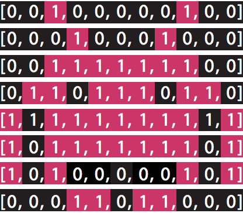

## 第9章：函数与列表

我们已经学习了如何使用函数，也学习了列表的使用，现在，我们要把他们联合起来使用。

这一章，我们将创建我们自己的函数，利用列表完成一些常见的任务。我们也会介绍一些很有用的，和列表一起使用的预置函数。

#### 9.1 Minecraft练习

##### 9.1.1 像素艺术

-----------------------------------

**知识与技巧**

本练习中，我们将练习的知识和技巧:

* 循环
* 循环嵌套

-----------------------------------

在这个练习中，您将使用多维列表，在Minecraft里创造像素级图像。这听起来令人兴奋，但它实际上很简单。做个简单的像素图像，类似太空入侵者:

正如你看到的，我们有一张小方块组成的正方形。每个小方块都被叫做一个像素。我们图片里的每个像素，只能用两种颜色中的一种，所以我们可以用一个整数来表示小方块的颜色，比如1和0。

上面每一行里的1和0，可以存到对应的列表里。然后这些代表行的列表作为数据项，再存进一个大列表里。

所以，一个像素级的图像可以被存储在多维列表里。让我们来看看，我们如何利用这些知识，在Minecraft里创建像素艺术。

**指令**

创建一个多维列表，包含上面太空入侵者的数据。**然后在Minecraft里用不同颜色的羊毛画出这幅画**。你需要将一个循环嵌套进另一个循环里，以便大列表里代表每一行的列表数据项，以及列表中的代表颜色的数据项都能被处理到。

**扩展练习**

* 完成一幅多颜色像素画

##### 9.1.2 阴影下的城堡

-----------------------------------

**知识与技巧**

本练习中，我们将练习的知识和技巧:

* for 循环

-----------------------------------

视频游戏里的坏家伙们在看起来邪恶的建筑里游荡。熔岩和黑曜石就看起来很邪恶。拷贝就更加邪恶。让我们拷贝你的一个建筑，改造它，让他看起来更加邪恶。

你应该已经用过Minecraft API里的getBlocks()函数了。但有的时候，这个函数不起作用。我们需要开发一个自己的版本代替它。下面是我们的版本，能做同样的事情：

	1. def getBlocks(x1, y1, z1, x2, y2, z2):
	2.     xhigh = max(x1, x2)
	3.     xlow = min(x1, x2)
	4.     yhigh = max(y1, y2)
	5.     ylow = min(y1, y2)
	6.     zhigh = max(z1, z2)
	7.     zlow = min(z1, z2)
	8.
	9.     blocks = []
	10.     for x in range(xhigh - xlow + 1):
	11.         blocks.append([])
	12.         for y in range(yhigh - ylow + 1):
	13.             blocks[x].append([])
	14.             for z in range(zhigh - zlow + 1):
	15.                 blocks[x][y].append([])
	16.                 block = mc.getBlock(xlow + x, ylow+ y, zlow + z)
	17.                 blocks[x][y][z] = block
	18.     return blocks

**指令**

这个对你是个真正的挑战。你需要自己完成代码，去实现一系列的需求。你已经具备了所有需要的知识，你只是需要考虑如何应用它们。

在你的程序里完成以下需求：

* 拷贝一个建筑，并把它存储在列表里
* 把这个拷贝里的石头替换成黑曜石，把水替换成岩浆
* 把这个拷贝放到一个新的位置

你也许注意到了，这里有一个bug：像羊毛、楼梯这样的块是有不同的状态的。修改我们提供的getBlocks()函数，修复这个bug。

#### 9.2 在函数中使用列表

正如我们讨论过的，制作自己的函数意味着你可以重用代码；节省你的时间和精力。函数有多种使用列表的方式。

列表可以作为函数的参数，可以和循环一起被函数使用。而函数可以被用来改变列表中的数据项。

##### 9.2.1 列表当参数

使用函数时可以传参数给他们。这种方式允许你给函数提供数据，这可以改变函数的行为。

可以用列表和字典做函数的参数。还记得我们介绍过函数的参数吗？

用列表做参数的语法，和其他普通参数的用户完全一样。用字典做参数也是一样的。

让我们写个基本的函数，接收列表参数，返回索引是1的数据项：

	1. def secondItem(list):
	2.     return list[1]
	3.
	4. animals = [”crow”, ”mantis”, ”snake”]
	5. print secondItem(animals) #prints mantis

##### 9.2.2 函数里的循环和列表

在函数里，循环可以用来访问列表的数据项。这时循环的工作方式，和函数外的循环是完全一样的。

这里有个简单的函数，利用循环分别打印列表里的每一项：

	1. def printList(list):
	2.     for item in list:
	3.         print item
	4.
	5. animals = [”crow”, ”mantis”, ”snake”]
	6. printList(animals)

##### 9.2.3 修改列表中的每一项

在编程中，修改数据项的值是一个常见的任务。通常情况下，你可以先找到数据项的位置索引，然后再修改它，像这样：

	1. list[index] = newValue

改变列表中的每一项，也是很常见的需求。

我们使用for循环修改列表中的每一项，只是我们需要对for循环稍作改动。上一章介绍的列表for循环，在每次循环的时候可以获得列表中数据项的值。为了修改数据项，我们获得数据项的位置索引，而不是数据项的值。联合使用range() 函数和len() 函数，可以帮你达成目的。

函数range()可以创建两个参数值之间的整数列表。第一个参数是开始的数字，第二个参数是截断数字，也就是说返回的整数列表到第二个参数位置，不包含第二个参数的值。range()创建这个整数列表，可以当我们列表的位置索引来用。

. . . . . . . . . . . . . . . . . . . . . . . . . . . . . . . . . . . . . . . . . . . . . . . . . . . . . . . . . . . . .

**range() - 两个参数**

*函数*

此函数创建整数列表。它可以有一个参数，或者两个参数，甚至三个参数。当提供两个参数时，第一个参数决定了返回列表中开始的数值，第二参数是指列表到这里截断。

**表达式**

	1. range(startIndex, cutOffIndex)

**语句**

	1. #打印数字 0 到 9
	2. for index in range(0,10):
	3.     print index

. . . . . . . . . . . . . . . . . . . . . . . . . . . . . . . . . . . . . . . . . . . . . . . . . . . . . . . . . . . . .

例如：

	1. aList = range(0, 5)

会创建列表：

	1. aList = [0, 1, 2, 3, 4]

创建使用位置索引的循环，采用下列方式：

	1. for item in range(0, len(listName)):
	2.     #body of for loop

采用上面的方式，就可以为数据项设置新的值。例如下面的代码，我们让列表中，每一项的数值都翻倍：

	1. numbers = [3, 6, 2, 8]
	2. for index in range(0, len(numbers)):
	3.     numbers[index] = numbers[index] * 2

这将把列表中的数据项，改成下面的值：

	1. [6, 12, 4, 16]

##### 9.2.4 改变列表中每个数据项的函数

你可以把改变列表数据项的循环代码，放进一个函数，这样就可以做到代码复用。例如，我们写一个函数，修改列表中每一项的值，让它和字符串“”codename:”拼在一起：

	1. def codeName(list):
	2.     for index in range(0, len(list)):
	3.         list[index] = ”codename: ” + list[index]
	4. animals = [”crow”, ”foxhound”, ”snake”]
	5. animalsWithCodenames = codeName(animals)

##### 9.2.5 更多关于 range()

. . . . . . . . . . . . . . . . . . . . . . . . . . . . . . . . . . . . . . . . . . . . . . . . . . . . . . . . . . . . .

**range() - 一个参数**

*函数*

此函数创建整数列表。它可以有一个参数，或者两个参数，甚至三个参数。当提供一个参数时，是指列表从0开始，到参数这里截断。

**表达式**

	1. range(cutOffValue)

**语句**

	1. #prints the values 0 to 9
	2. for index in range(10):
	3.     print index

. . . . . . . . . . . . . . . . . . . . . . . . . . . . . . . . . . . . . . . . . . . . . . . . . . . . . . . . . . . . .

. . . . . . . . . . . . . . . . . . . . . . . . . . . . . . . . . . . . . . . . . . . . . . . . . . . . . . . . . . . . .

**range() - 三个参数**

*函数*

此函数创建整数列表。它可以有一个参数，或者两个参数，甚至三个参数。当提供三个参数时，第一个参数开始的值，第二参数是到这里截断，第三个参数是每个值之间的增长量。

**表达式**

	1. range(startValue,cutOffValue,increment)

**语句**

	1. #prints the values 0,2,4,6,8
	2. for index in range(0,10,2):
	3.     print index

. . . . . . . . . . . . . . . . . . . . . . . . . . . . . . . . . . . . . . . . . . . . . . . . . . . . . . . . . . . . .

我们知道range()函数可以创建整数列表。在和for语句、len函数一起使用的时候，它可以用来表示列表的位置索引。

range()函数可以有一个参数，或者两个参数，甚至三个参数。不同的参数决定了这个函数的工作方式。

当只有一个参数时，这个函数返回的列表，将会从0开始，从参数这里截断。例如：

	1. agents = range(5) # creates list [0, 1, 2, 3, 4]

有两个参数的时候，函数返回的列表，将从第一个参数开始，在第二参数之前结束。例如：

	1. agents = range(2, 5) \# creates [2, 3, 4]

有第三个参数的时候，第三个参数是值每次的增长量。

换句话说，列表中的每个值，一般情况下，比前一个值大1。要改变每个值比上一个值的增长量，就可以设置这第三个参数。例如，设置2，就意味着，前一个值加2就是下一个值。我们称，这个列表增长的步长是2：

	1. agents = range(3, 10, 2) \# creates [3, 5, 7, 9]

##### 9.2.6 把列表转换成字符串

使用join()函数，你可以合并列表中的所有数据项，生成一个字符串。

. . . . . . . . . . . . . . . . . . . . . . . . . . . . . . . . . . . . . . . . . . . . . . . . . . . . . . . . . . . . .

**Join**

*函数*

join()函数 合并列表中的所有数据项，生成一个字符串。把你想生成字符串的列表，当成join函数的参数。新字符串中，分割各个数据项的分隔字符，加上点号调用join函数。

**表达式**

	1. ”divider”.join(list)

**语句**

	1. shoppingList = [”shoes”, ”hat”, ”trousers”]
	2. print ”/”.join(shopping)
	3. #prints shoes/hat/trousers

. . . . . . . . . . . . . . . . . . . . . . . . . . . . . . . . . . . . . . . . . . . . . . . . . . . . . . . . . . . . .

表达式的第一部分，是新字符串中，分割各个数据项的分隔字符。后面再用一个点号“.”调用join函数，要操作的列表当成join函数的参数。

例如：

	1. cats = [”fluffy”, ”charles”, ”igor”, ”ginger”]
	2. print ” + ”.join(cats)

这段代码将打印”fluffly + charles + igor + ginger”。

##### 9.2.7 把字符串分割成列表

在字符串上使用split()函数，可以把字符串分割成列表。

. . . . . . . . . . . . . . . . . . . . . . . . . . . . . . . . . . . . . . . . . . . . . . . . . . . . . . . . . . . . .

**Split**

*函数*

Split()函数把字符串分割成列表。没有参数时，使用空格分割字符串，遇到空格就创建一个新的数据项。有参数时，用参数做分隔符。

**表达式**

	1. ”string”.split(”divider”)

**语句**

	1. sentence = ”Do a barrell roll”
	2. myList = sentence.split()
	3. #创建了一个新列表，值是:
	4. #[”Do”, ”a”, ”barrell”, ”roll”]

. . . . . . . . . . . . . . . . . . . . . . . . . . . . . . . . . . . . . . . . . . . . . . . . . . . . . . . . . . . . .

默认情况下，用空格做分割符分割字符串。其他分隔符可以做参数传给split函数。例如使用“/”分割：

	1. instructions = ”Strip the paint/sand the  wood/apply a primer/apply the paint”
	2. instructionsAsList = instructions.split(”/”)
	3. #结果值是:
	4. [”Strip the paint”, ”sand the wood”, ”apply a  primer”, ”apply the paint”]

#### 9.3 使用多个列表

有很多原因你会使用多个列表。可能是在列表中放入列表，或者是用不定长的列表做函数的参数。这一章里，我们将涵盖这些内容。

##### 9.3.1 多维度列表

列表可以包含其他数据类型，包括其他列表。

想象列表就像一些纸板箱。第一个纸板箱里是一条蛇，第二个箱子里是香蕉，第三个里有一个机器人。在这个例子里，每一个箱子都代表列表里的索引，箱子里的东西，是列表数据项的值。箱子里可以包含箱子。在第一个箱子里，现在有三个箱子，三个箱子里各装着一种动物。类似于箱子里面装箱子，列表里面也可以包含列表。

用下面的列表，表示上面箱子的例子：

	1. boxes = [[”Snake”, ”Cat”, ”Bear”], ”banana”, ”robot”]

访问列表里的列表，你需要两个方括号，第一个方括号是最外边列表的索引，第二方括号是里面列表的索引。例如，我们要打印“Cat”项，应该像下面那样访问：

	1. print boxes[0][1]	

任意数量的列表都可以嵌套在其他列表里。你刚才看到的只是一个二维数组。还有三维数组以及更多。为了避免疑惑，建议你在使用更高维度的数组之前，先掌握二维数组。

. . . . . . . . . . . . . . . . . . . . . . . . . . . . . . . . . . . . . . . . . . . . . . . . . . . . . . . . . . . . .

**多维列表**

*数据类型*

多维列表是包含列表的列表。它通过把一个列表放入另一个列表来实现。访问被嵌套的列表项，可以过两个或多个方括号。第一个方括号是最外边列表的索引，第二方括号是里面列表的索引。

**表达式**

	1. list[][]

**语句**

	1. team = [[”Jim”, ”Cat”, ”Milk”], ”Monkey”, ”Robot”,  ”Ninja”]
	2. print team[0][2] #prints Milk
	3. print team[2] #prints Monkey

. . . . . . . . . . . . . . . . . . . . . . . . . . . . . . . . . . . . . . . . . . . . . . . . . . . . . . . . . . . . .

##### 9.3.2 连接两个数组

+号可以将两个数相加，也可以连接字符串。其实它还可以用来连接两个数组。

通过连接两个数组，我们可以创建一个包含所有数据的新数组。

例如，我们要把两个电子零件列表合并，创建一个新的列表：

	1. gps = [”gps module”, ”circuit board”, ”wires”]
	2. arduino = [”arduino”, ”wires”, ”battery”, ”jack”]
	3. tracker = gps + arduino

现在tracker包含了两个列表所有的数据项：

	1. [”gps module”, ”circuit board”, ”wires”,  ”arduino”, ”wires”, ”battery”, ”jack”]

一个连接列表的函数，可以写成这样：
	1. def combineLists(list1, list2):
	2.     return list1 + list2

. . . . . . . . . . . . . . . . . . . . . . . . . . . . . . . . . . . . . . . . . . . . . . . . . . . . . . . . . . . . .

**列表连接 +**

*操作符*

+号把两个列表连接在一起，新建一个包含二者数据的列表。

**表达式**

	1. list + list

**语句**

	1. clothesList = [”shoes”, ”hat”, ”trousers”]
	2. foodList = [”cake”, ”butter”, ”fish”]
	3. shoppingList = clothesList + foodList

. . . . . . . . . . . . . . . . . . . . . . . . . . . . . . . . . . . . . . . . . . . . . . . . . . . . . . . . . . . . .

##### 9.3.3 使用不确定数目的列表

你也许还记得 * 在定义函数参数时的用法。* 号会告诉函数，不确定参数的数量：

	1. def functionName(*argument):
	2. #body of function

函数在收到参数时，会把它们转成一个列表。

使用 * 号也可以向函数传递任意数量的列表：

	1. def packageElectronics(*list):
	2.     return list
	3.
	4. gps = [”gps module”, ”circuit board”, ”wires”]
	5. arduino = [”arduino”, ”wires”, ”battery”, ”jack”]
	6. wireless = [”Electric Imp”, ”April”]
	7.
	8. parcel = packageElectronics(gps, arduino, wireless)

参数中的列表都会放进一个大列表里，形成多维列表。例子中parcel的值是：

	1. [[”gps module”, ”circuit board”, ”wires”],  [”arduino”, ”wires”, ”battery”, ”jack”],  [”Electric Imp”, ”April”]]

你可以看到三个列表都在一个大列表里，列表中的列表，和一般的列表语法没有区别，依然是用[开头，]结尾。

这是一个列表中列表的例子，一个多维列表。